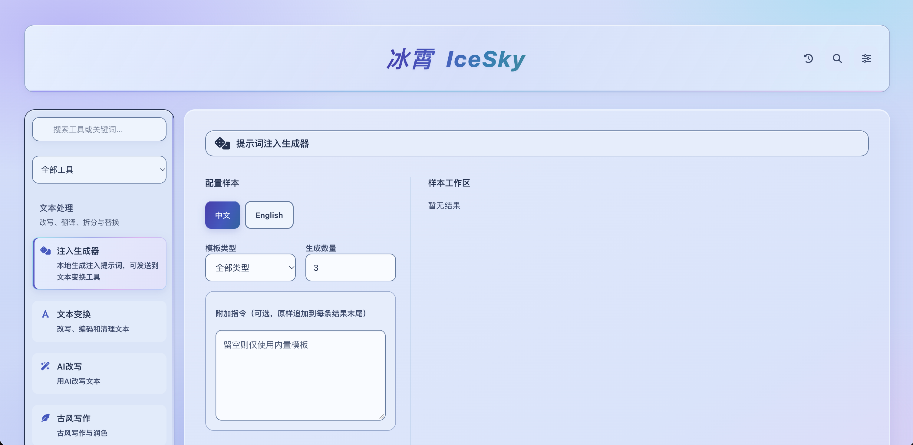

# 冰霄IceSky

面向AI安全测试的提示词注入工具集。在浏览器中编辑测试载荷，进行文本变换、隐写与多轮对话编排，生成文档、图像、音频、邮件、网页、MCP定义和Agent规则文件等测试样本。

## 界面预览



## 功能

### 文本处理与隐写

| 工具 | 能力 |
| --- | --- |
| 文本变换 | 编码、古典密码、Unicode字形、大小写与格式转换，支持变换链、随机混排及部分格式的逆向还原 |
| 通用解码器 | 自动识别编码，或指定方法尝试还原文本 |
| Ascii走私 | 在可见文本中嵌入隐藏内容，提取和检查隐藏文本 |
| Emoji | Emoji插入与变体选择符隐写 |
| 字符映射 | 配置字符映射并替换文本 |
| 文本拆分 | 按长度、句子或段落拆分文本 |
| 输入扰动 | 批量生成文本变体，用于输入鲁棒性测试 |
| 乱码与资源消耗 | 生成噪声文本或高Token用量文本，用于资源压力测试 |
| 古风写作 | 基于本地规则生成文言、古风候选文本，支持原文对比 |
| AI改写与翻译 | 调用配置的模型接口改写或翻译文本，具体可用性取决于接口、模型和账户权限 |

文本变换通过Web Worker执行，支持进度反馈和取消任务。任务设有30秒超时、2M字符输入上限和100步变换链上限。输入或选项改变后，不再使用旧任务的结果。

### 提示词与对话样本

- **提示词注入生成器**：组合模板、载体、手法与目标载荷，支持多语言、变体、宿主文本插入、随机种子和内联变换链，可导出TXT、JSON、JSONL。
- **多轮模板**：编排消息角色、正文和变量，按不同消息格式导出，也可通过配置的模型接口测试对话。
- **样本构造**：组合正常材料与测试载荷，调整插入位置、包装、重复、分块和处理步骤，支持保存、导入与导出构造设置。
- **批量样本**：按参数逐项变化或组合生成，支持JSON、JSONL和混合ZIP。ZIP按载体分目录保存实际文件，并附带`manifest.json`，不只是将文本更改扩展名。

样本构造支持RAG、搜索结果、工具返回、记忆、多轮消息，以及下表中的文件和配置载体。批量生成最多输出200份样本，总大小上限为5 MB，会跳过不兼容或重复的候选。

### 文件与配置载体

| 工具 | 主要测试通道 |
| --- | --- |
| 图像注入 | 可见画面、EXIF元数据、LSB像素隐写、二维码和SVG |
| 音频注入 | 音轨、字幕、INFO和ID3元数据，以及频谱等通道，支持WAV、VTT、SRT样本 |
| PDF注入 | PDF样本生成、文本提取与隐藏内容分析 |
| DOCX注入 | Word文档中的隐藏文字、批注和页眉等内容 |
| XLSX注入 | 隐藏工作表、批注和定义名称等表格通道 |
| PPTX注入 | 幻灯片备注、隐藏形状和元数据 |
| 网页注入 | HTML标题、Open Graph、JSON-LD、注释、隐藏节点及sitemap和robots内容 |
| 邮件EML注入 | 邮件主题、正文、引用、隐藏层与附件 |
| MCP定义 | 编辑工具、参数说明、资源与提示定义，导出JSON，不启动MCP服务 |
| Skill与Agent规则 | 生成`SKILL.md`、`AGENTS.md`、`CLAUDE.md`、`GEMINI.md`及Copilot、Cursor、Windsurf、Aider、Continue、Cline、Roo规则，支持单文件或ZIP导出 |
| 富文本注入 | Markdown、HTML与富文本内容生成和分析 |

样本构造还可导出迷你仓库包，将可见材料与代码注释、GitHub Actions YAML、Dockerfile等内容放在同一份样本中。具体写入通道取决于所选载体和设置。不同解析器、办公软件或模型未必会读取同样的内容。

### 分析与参考

- Token计数与可视化，标注空白、零宽字符、控制字符等特殊内容。计数结果取决于所选分词引擎，估算值不等于所有模型的实际计费值。
- 异常Token与特殊格式参考。
- 提示词注入技术分类，按类型查阅方法和说明。
- 破限库，按模型、标签或关键词查找提示词与仓库资料，支持编辑、导出和带入其他工具。仓库摘要与提示词原文分别标注。

### 工作台交互

工具按文本处理、对话与隐写、文件注入、分析与测试分组，支持搜索、常用工具固定、最近使用和命令面板。移动端可在编辑区与结果区之间跳转。

跨工具带入文本时，会在覆盖已有内容前询问，并提供撤销。带入后仍需在目标工具确认设置、重新生成结果。样本构造会显示生成中、生成失败和待更新状态，阻止复制或导出与当前设置不一致的预览结果。

复制历史支持搜索与导出，并限制条数和容量。破限库、注入技术等资源按需加载，加载失败时可重试。

## 快速开始

本仓库是可直接部署的静态文件，不需要安装Node.js依赖或运行构建命令。

```bash
git clone https://github.com/spindriftpapilio/icesky.git
cd icesky
python3 -m http.server 8080 --bind 127.0.0.1
```

在浏览器中打开<http://localhost:8080>。

常见使用流程：

1. 在提示词注入生成器中选择模板和载荷，或直接填写测试文本。
2. 带入样本构造，选择载体、注入字段和处理步骤。
3. 生成并检查预览，确认下载格式和文件列表，修改设置后重新生成。
4. 下载单份文件或混合样本包，在获得授权的目标环境中测试并记录结果。

需要细调文件通道时，可将载荷送到对应的专用工具继续编辑。AI辅助功能需要先在设置中配置API地址、密钥和模型。

## 部署

将仓库中的静态文件按原目录结构上传到GitHub Pages、Cloudflare Pages、Netlify、Vercel、S3或其他静态Web服务器即可。无需为本地文本处理和样本生成配置后端。

## 项目结构

```text
.
├── index.html              # 应用入口
├── css/
│   ├── components/         # 工作台、布局和操作反馈样式
│   ├── tools/              # 各工具专用样式
│   └── vendor/             # Font Awesome样式与字体
├── js/
│   ├── app/                # 导航、历史、命令与模型管理
│   ├── bundles/            # 文本变换引擎与Worker脚本
│   ├── config/             # 配置与工具元数据
│   ├── core/               # 解码、隐写与工具注册
│   ├── data/               # 模板、Emoji、Token与分类数据
│   ├── tools/              # 工具实现与载体生成库
│   ├── utils/              # 加载、存储、任务调度与文件处理
│   └── vendor/             # Vue、JSZip、PDF.js、pdf-lib等资源
```

## 交流群


## 法律免责声明与使用合规须知

### 1. 工具定位

冰霄IceSky（以下简称“本工具”）用于AI与网络安全学术研究、获得授权的安全测试、企业内部风险自查和教育演示。提示词注入、隐写、文件载体和Agent规则等功能用于构造测试材料，帮助验证目标系统的输入处理与安全边界。

本工具不授予使用者测试任何第三方系统的权限。生成样本、查阅公开资料或取得API密钥，均不等于获得对目标系统开展安全测试的授权。

### 2. 授权使用原则

对目标系统开展测试前，使用者必须取得系统所有者或有权授权方的合法书面授权，明确测试对象、时间、方法、数据范围、资源消耗上限和停止条件。测试不得超出授权范围，并须遵守适用法律和服务协议。

### 3. 禁止滥用

使用者不得利用本工具：

1. 生成恶意内容进行广泛传播，包括违法信息、诈骗话术、钓鱼链接、恶意代码及用于窃取数据或破坏系统的攻击载荷。
2. 诱导模型或Agent泄露密钥、个人信息和其他未获授权的数据，或执行未获授权的命令、文件操作及外部请求。
3. 将含有恶意载荷的文档、邮件、网页、MCP定义、Skill或Agent规则投放到未经授权的第三方环境。
4. 开展未授权批量测试、网络骚扰、黑灰产活动或以违法方式牟利。
5. 以非法用途规避本工具、目标系统或服务提供方的安全限制和访问控制，或利用高Token用量文本等功能干扰服务、消耗他人资源。
6. 从事危害国家网络安全、扰乱公共秩序或侵犯他人合法权益的活动。

### 4. 风险与责任边界

本工具按现状提供。在适用法律允许的范围内，项目作者、维护者和贡献者不对其准确性、完整性、适用性、持续可用性或测试效果作出保证。

使用者应自行审查输入材料、生成文件、模型接口及目标环境，评估数据泄露、模型调用费用、资源消耗、文件兼容性和服务中断等风险。样本生成成功或本地预览正常，不代表在目标系统中使用是安全、合法或有效的。

使用者应自行承担使用本工具所产生的全部风险及后果。开发者不承担任何责任。因使用、修改、分发本工具或将生成样本用于第三方系统而引起的损失、纠纷及法律责任，均由使用者自行承担，与项目作者、维护者和贡献者无关。

### 5. 合规义务

使用者应了解并遵守所在地、目标系统所在地及测试活动适用的法律法规。

使用者须妥善保管授权证明和必要的测试记录，按约定处理、保存和删除测试数据。向外部模型接口发送材料前，应确认具备相应的数据处理权限，不得擅自上传个人信息、商业秘密或其他受保护数据。

### 6. 违规处置

对于已知或有合理依据怀疑涉及违法滥用的请求，项目维护者可拒绝提供技术答疑、指导或协助，并可在法律及适用许可允许的范围内调整项目分发、维护安排和安全限制。

对通过问题反馈、公开渠道或其他合法途径获知的滥用线索，维护者可依法保留必要证据并向有关平台或主管机关报告。本条不表示本工具具备远程监控、追踪使用者或撤回已下载副本的能力。

### 7. 最终声明

请在使用前阅读上述条款，并自行确认测试活动已获授权且符合法律要求。如无法确认授权或合规性，请勿对目标系统开展测试。

本工具严禁非法滥用。任何违法使用行为所产生的法律责任均由行为人自行承担，与项目开发、维护和贡献团队无关。

## Star趋势

[](https://star-history.com/#spindriftpapilio/icesky&Date)
